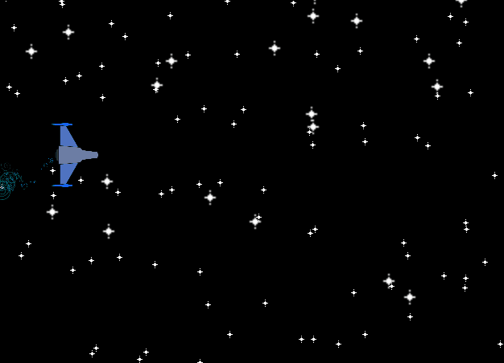

# chute-shoot

My first [Godot](https://godotengine.org/) project, a shoot-em-up idea based off of a pun.

I'm trying mechanic ideas and testing my `C#` skills while learning `Godot 4.0`.

---

The Result so far:

Note the complete lack of chutes and shooting at this stage, but check out that sweet, sweet parallax effect.
